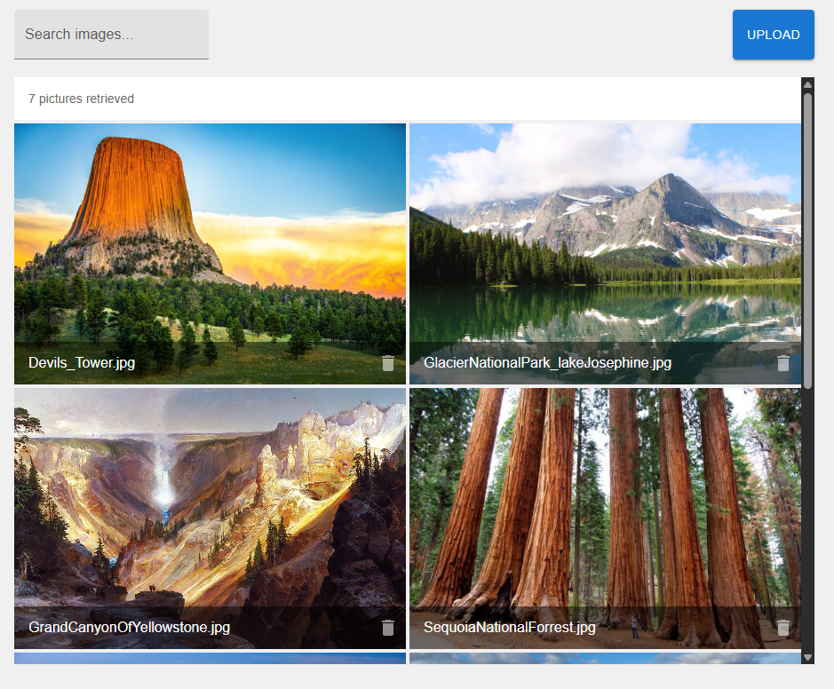

# Takehome assessment

# How to run
## Using docker (recommended)

After starting the docker engine you can use 

    docker compose up --build

in the root directory of this project to launch the frontend on localhost:3000 and the backend on localhost:3001

## Using npm
Navigate to the backend directory and run

    npm i 
    npm run start

then, navigate to the frontend directory and run 

    npm i 
    npm run start

Note: This is a next.js project and needs to be built before npm run start will work. To meet project requirements (i.e. - it should be able to be brought up with the following two (2) commands: ● npm i ● npm start) npm run start on the frontend has been condensed to both  build and run. (the package.json has been modified from "start": "next start" to "start": "next build && next start")

The project will be accessable at localhost:3000

# 3rd party libaries used
* [Material ui](https://mui.com/material-ui/getting-started/)
    * [Image list with title bars](https://mui.com/material-ui/react-image-list/#title-bar-below-image-standard)
    * [Snackbar](https://mui.com/material-ui/react-snackbar/)

# Additional notes:
Including writing the backend, the read me, and the containerization, the application took me about 8.5 hours to complete. \
Though the focus of this takehome is on the frontend portion, I will also include notes about what I think should be included in the future if I had additional time or if this were a long term project. 

### File filtering
The requirements state that only images are allowed to be uploaded to the application. This feature was implemented with a few layers. 
Using

    <input type="file" accept="image/*">

shows the user only image files on their computer. However, it's pretty easy to circumvent this. \
The second layer

    if (!file.type.startsWith("image/")){

rejects anything other then images from being uploaded and present the use with an MUI snackbar (a popup) with dialog mentioning that the selected file was not uploaded due to it's file type. \
Despite these measures, a user can still circumvent these implementations by changing the file extension to a .jpeg, .png, or any other image file type. 

## Additional features for longer term project or additional time
### Additional loading feedback
Since the images were not in either cloud storage or on a seperate server the fetch requests were quick. Had there been significant loading time, I would have implemented [mui's skeleton](https://mui.com/material-ui/react-skeleton/#variants) to give better feedback to the user that images are supposed to be present and are currently loading. Implementing this would have gone unnoticed since the fetches were too quick

### Drag and drop upload

### Undo delete feature
For destructive actions, I always like to have either a confirmation or an ephemeral option to undo the action. Twords the end of the assignment I discovered [mui's snackbar](https://mui.com/material-ui/react-snackbar/) that I used to implement a notification when a type other than an image has been uploaded.\
If I had more time I would have implemented a solution to undo the delete using a snackbar.
